# Архитектура ProfileMirrorSync

> Версия документа соответствует кодовой базе **v2.5.3**  
> Платформа: `net9.0-windows` · WinForms · one-file WinExe · `win-x64`  
> Нет сторонних NuGet-зависимостей

---

## Содержание

1. [Назначение и контекст](#1-назначение-и-контекст)  
2. [Птичий взгляд — обзорная схема слоёв](#2-птичий-взгляд--обзорная-схема-слоёв)  
3. [Компонентная диаграмма — модули и зависимости](#3-компонентная-диаграмма--модули-и-зависимости)  
4. [Диаграмма классов по ключевым связям](#4-диаграмма-классов-по-ключевым-связям)  
5. [Потоки данных в реальном времени (ASCII)](#5-потоки-данных-в-реальном-времени-ascii)  
6. [Sequence diagram — один файл: FSW → сетевая папка](#6-sequence-diagram--один-файл-fsw--сетевая-папка)  
7. [Sequence diagram — цикл плановой реконсиляции](#7-sequence-diagram--цикл-плановой-реконсиляции)  
8. [State machine — жизненный цикл контроллера](#8-state-machine--жизненный-цикл-контроллера)  
9. [Deployment diagram — топология развёртывания](#9-deployment-diagram--топология-развёртывания)  
10. [Модель параллелизма](#10-модель-параллелизма)  
11. [Подсистема копирования файлов (ThrottledFileCopier)](#11-подсистема-копирования-файлов-throttledfilecopier)  
12. [Алгоритм реконсиляции (три прохода)](#12-алгоритм-реконсиляции-три-прохода)  
13. [Планировщик реконсиляции и адаптивный триггер](#13-планировщик-реконсиляции-и-адаптивный-триггер)  
14. [Расположение файлов и пути данных](#14-расположение-файлов-и-пути-данных)  
15. [Надёжность и обработка ошибок](#15-надёжность-и-обработка-ошибок)  
16. [Фильтрация и исключение файлов](#16-фильтрация-и-исключение-файлов)  
17. [Периодические фоновые задачи](#17-периодические-фоновые-задачи)  
18. [Многопользовательская модель](#18-многопользовательская-модель)  
19. [Настройки и значения по умолчанию](#19-настройки-и-значения-по-умолчанию)  

---

## 1. Назначение и контекст

**ProfileMirrorSync** — однопроцессное Windows-приложение в системном трее. Его задача: непрерывно зеркалировать папки профиля пользователя (`Desktop`, `Documents`, `Downloads`, `AppData/…` и произвольные папки) на сетевой ресурс (SMB-шара, mapped drive), работая незаметно для пользователя.

Два взаимодополняющих механизма защиты данных:

```
┌──────────────────────────────────────────────────────────────┐
│  Реальное время                   Плановая реконсиляция      │
│  (FileSystemWatcher)              (периодический обход)      │
│                                                              │
│  • Реагирует на каждое изменение  • Ловит пропущенные        │
│  • Debounce + deduplicate         • Ликвидирует «сироты»     │
│  • Bounded channel ← back-press.  • Распространяет mtime     │
│  • Turbo при event-storm          • Работает ≥ раз/сутки     │
└──────────────────────────────────────────────────────────────┘
```

**Ключевые нефункциональные цели:**

| Цель | Механизм |
|------|----------|
| Нет ощутимой нагрузки на ПК | `ProcessPriorityClass.Idle`, IO-поток на фоне |
| Нет спайков на сетевом аплинке | Token-bucket лимитер, turbo только при шторме |
| Устойчивость к перебоям сети | Проба `Directory.Exists` с таймаутом 5 с, retry-with-backoff |
| Атомарные обновления конфигурации | Запись в `.tmp` → rename |
| Продолжение прерванных копий | Byte-range resume сайдкары (SHA-256 головы файла) |
| Один экземпляр на сессию | `Local\` именованный мьютекс |

---

## 2. Птичий взгляд — обзорная схема слоёв

```mermaid
flowchart TB
    subgraph UI["🖥  UI Layer  (UI/)"]
        direction LR
        TrayApp["TrayApp<br>(ApplicationContext)"]
        SettingsForm["SettingsForm"]
        StatsForm["StatsForm"]
        LogViewerForm["LogViewerForm"]
    end

    subgraph Orchestration["⚙  Orchestration  (Services/)"]
        direction TB
        SC["SyncController<br>[lifecycle · queue · FSW · dispatch]"]
    end

    subgraph RealTime["⚡  Real-time pipeline"]
        direction LR
        FSW["FileSystemWatcher<br>×N корневых папок"]
        DEB["Debounce<br>(Task.Delay + CTS)"]
        DEDUP["ConcurrentDictionary<br> dedupe set"]
        CH["BoundedChannel<br>&#60;SyncOperation&#62;<br>(back-pressure)"]
        WORKER["Queue worker<br>ProcessQueueAsync()"]
    end

    subgraph BackgroundLoops["🔄  Background loops  (Tasks)"]
        direction LR
        RECON["ReconcileLoopAsync<br>(60 s poll)"]
        POSTSYNC["PostSyncLoopAsync<br>(independent timer)"]
        LOGMIRROR["LogMirrorService<br>(1×/day)"]
        REGSNAPSHOT["RegistrySnapshotService<br>(configurable interval)"]
    end

    subgraph CoreServices["🔧  Core services"]
        direction LR
        FM["FileMirror<br>(3-pass reconcile)"]
        TFC["ThrottledFileCopier<br>(async chunk + resume)"]
        BRL["ByteRateLimiter<br>(token-bucket)"]
        TURBO["TurboModeController"]
        RSCHED["ReconcileScheduler<br>(jitter + early trigger)"]
    end

    subgraph State["💾  State & persistence"]
        direction LR
        SS["SettingsStore<br>(settings.json)"]
        PSS["PersistentStateStore<br>(monitor_state.json)"]
        RSS["ResumeStateStore<br>(resume/*.json)"]
        LOG["Logger<br>(daily rolling)"]
    end

    subgraph FileSystem["📁  File system"]
        direction LR
        SRC["Source folders<br>%USERPROFILE%\\…"]
        DST["Network share<br>\\\\server\\share\\<br>Machine\\User\\"]
    end

    TrayApp -->|"owns"| SC
    TrayApp -->|"opens"| SettingsForm
    TrayApp -->|"opens"| StatsForm
    TrayApp -->|"opens"| LogViewerForm
    TrayApp -->|"GetStatsSnapshot()"| SC

    SC --> FSW
    FSW -->|"events"| DEB
    DEB --> DEDUP
    DEDUP --> CH
    CH --> WORKER

    SC --> RECON
    SC --> POSTSYNC
    SC --> LOGMIRROR
    SC --> REGSNAPSHOT

    WORKER -->|"DispatchAsync()"| FM
    RECON -->|"EnqueueAllReconcile()"| CH
    FM --> TFC
    TFC --> BRL
    TURBO -->|"UpdateRate()"| BRL
    RSCHED -->|"Evaluate()"| RECON

    SC --> TURBO
    SC --> RSCHED

    FM -->|"reads/writes"| SRC
    FM -->|"reads/writes"| DST
    TFC -->|"sidecar"| RSS

    SC --> PSS
    SC --> SS
    SC --> LOG
```

---

## 3. Компонентная диаграмма — модули и зависимости

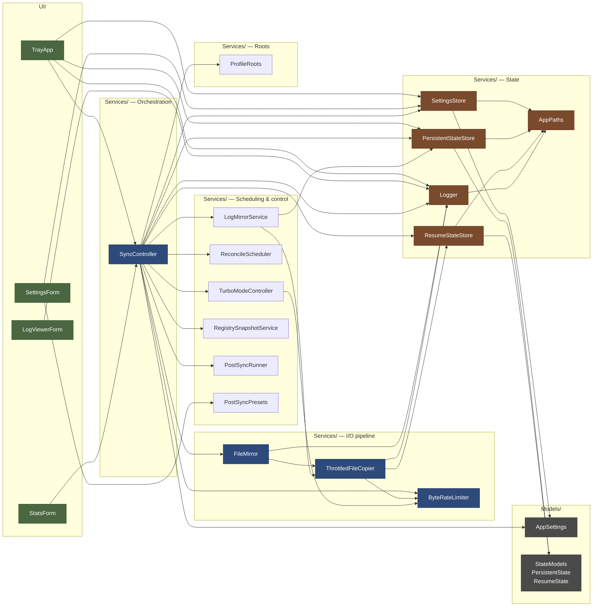

---

## 4. Диаграмма классов по ключевым связям

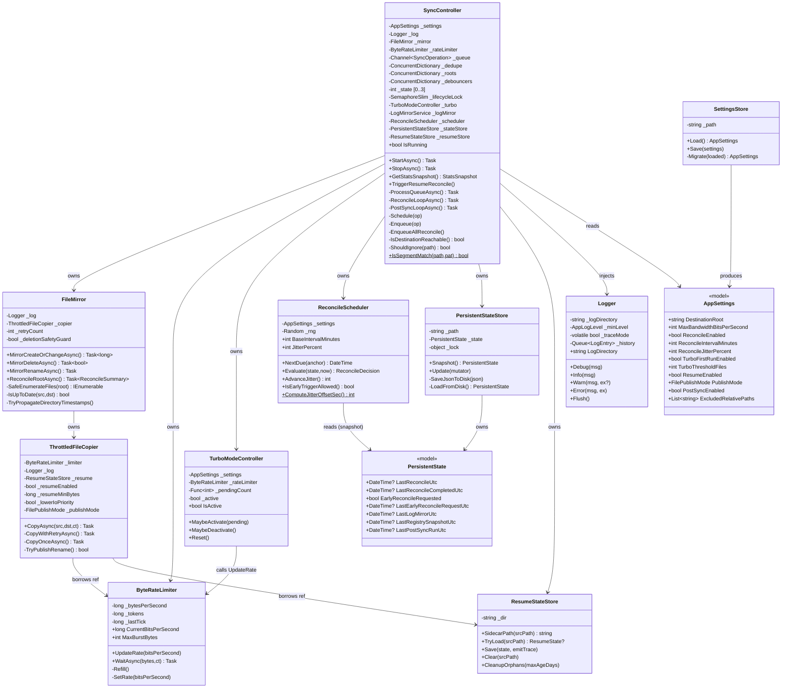

---

## 5. Потоки данных в реальном времени (ASCII)

```
╔══════════════════════════════════════════════════════════════════════════╗
║  ИСТОЧНИК (локальный профиль)     БУФЕР            НАЗНАЧЕНИЕ (SMB)      ║
╠══════════════════════════════════════════════════════════════════════════╣
║                                                                          ║
║  %USERPROFILE%\Desktop            ┌─ debounce     \\server\share\        ║
║  %USERPROFILE%\Documents     FSW  │  700 ms CTS   MACHINE\USER\          ║
║  %USERPROFILE%\Downloads ────────►│               Desktop\               ║
║  %APPDATA%\…              events  │  dedupe set   Documents\             ║
║  <CustomFolders>                  │  (ConcDict)   Downloads\             ║
║                                   │               …                      ║
║  ── REAL-TIME PATH ──────────────►│◄──────────────── priority drop ──    ║
║                                   │  BoundedChannel                      ║
║                                   │  capacity=N (default 1000)           ║
║                                   │                                      ║
║  Created  → CreateOrChange ───────┤  FULL? → drop + log 30s              ║
║  Changed  → CreateOrChange ───────┤  Delete/Rename → retry 5s write      ║
║  Deleted  → Delete ───────────────┤                                      ║
║  Renamed  → Rename ───────────────┤                                      ║
║  Error    → Reconcile ────────────┤                                      ║
║                                   ▼                                      ║
║                          ProcessQueueAsync()                             ║
║                          [single Task.Run worker]                        ║
║                                   │                                      ║
║                          DispatchAsync(op)                               ║
║                          ┌────────┴───────────────────────┐              ║
║                          │  CreateOrChange → FileMirror   │              ║
║                          │  Delete         → FileMirror   │              ║
║                          │  Rename         → FileMirror   │              ║
║                          │  Reconcile      → RunReconcile │              ║
║                          └────────────────────────────────┘              ║
║                                                                          ║
║  ── RECONCILE PATH ──────────────────────────────────────────────────    ║
║                                                                          ║
║  ReconcileLoopAsync() ──poll 60s──► ReconcileScheduler.Evaluate()        ║
║  IsDue?                                                                  ║
║  └── YES → EnqueueAllReconcile() ──► BoundedChannel (kind=Reconcile)     ║
║                                                                          ║
║  FileMirror.ReconcileRootAsync()                                         ║
║  ├── Pass 1: copy new/changed  (rate-limited, batched)                   ║
║  ├── Pass 2: delete orphans    (rate-limited, batched)                   ║
║  └── Pass 3: propagate dir timestamps  (bottom-up)                       ║
║                                                                          ║
╠══════════════════════════════════════════════════════════════════════════╣
║  TOKEN-BUCKET   baseline 1 Mbit/s  ─── turbo 3 Mbit/s (≥1000 pending)    ║
╚══════════════════════════════════════════════════════════════════════════╝
```

### Анатомия `SyncOperation`

```
SyncOperation {
  Kind:              CreateOrChange | Delete | Rename | Reconcile
  SourcePath:        полный путь источника
  DestinationPath:   полный путь назначения (pre-computed)
  NewPath?:          только для Rename (новое имя в источнике)
  NewDestinationPath?: только для Rename (новый путь в назначении)
}
```

Ключ дедупликации:
- Rename: `"{SourcePath}|{NewPath}"`
- Всё остальное: `"{SourcePath}"`

---

## 6. Sequence diagram — один файл: FSW → сетевая папка

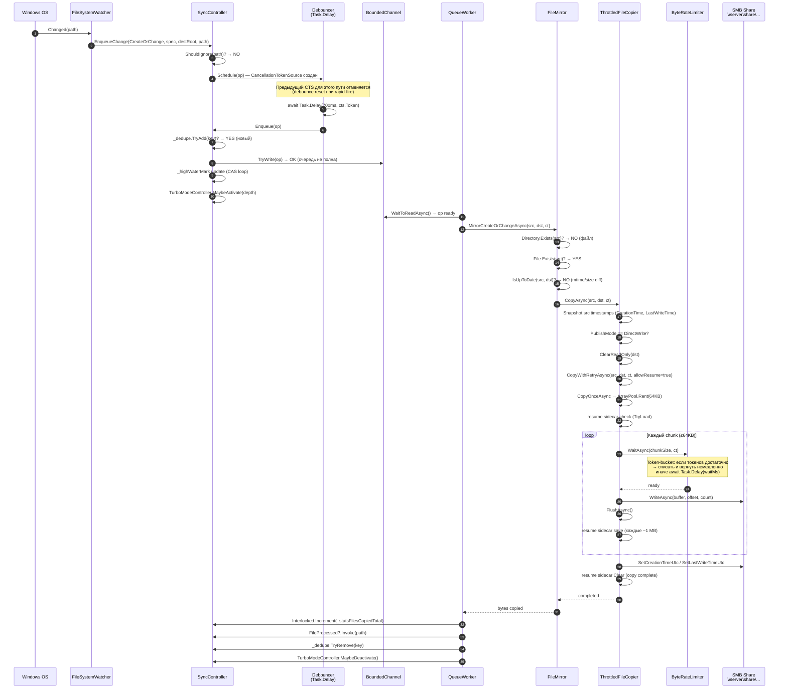

---

## 7. Sequence diagram — цикл плановой реконсиляции

```mermaid
sequenceDiagram
    autonumber
    participant RCL as ReconcileLoopAsync
    participant SCHED as ReconcileScheduler
    participant PSS as PersistentStateStore
    participant SC as SyncController
    participant CH as BoundedChannel
    participant WRK as QueueWorker
    participant FM as FileMirror
    participant TFC as ThrottledFileCopier
    participant NET as SMB Share
    participant LMS as LogMirrorService
    participant REG as RegistrySnapshotService

    loop каждые 60 секунд
        RCL->>PSS: Snapshot()
        RCL->>SCHED: Evaluate(state, now)
        Note over SCHED: NextDue = LastReconcileUtc<br/>+ BaseInterval + jitterSec
        alt не пора
            SCHED-->>RCL: IsDue=false, continue
        else пора (по времени или early-trigger)
            SCHED-->>RCL: IsDue=true, DueByEarly=?
            RCL->>RCL: IsDestinationReachable()?
            alt сеть недоступна
                RCL->>RCL: log Warn (dedup per-outage)
                RCL-->>RCL: continue (без advance anchor)
            else сеть доступна
                RCL->>PSS: Update(s => LastReconcileUtc=now, EarlyReconcileRequested=false)
                RCL->>SC: Interlocked.Exchange(_statsLastReconcileStartTicks)
                RCL->>SC: EnqueueAllReconcile()
                Note over SC: rootsRemaining = roots.Count<br/>Push Reconcile op per root
                SC->>CH: Write(Reconcile, root1, destRoot1)
                SC->>CH: Write(Reconcile, root2, destRoot2)
                RCL->>REG: MaybeCaptureRegistrySnapshotAsync()
                RCL->>RCL: schedule WS-trim (Task.Delay 2min -> EmptyWorkingSet)
                RCL->>SCHED: AdvanceJitter()
            end
        end
    end

    WRK->>FM: ReconcileRootAsync(srcRoot, dstRoot, shouldIgnore, opts)
    rect rgb(40, 60, 40)
        Note over FM: Pass 1: copy new/changed files
        FM->>FM: SafeEnumerateFiles(srcRoot)
        loop каждый файл в источнике
            FM->>FM: shouldIgnore(file)? -> skip
            FM->>FM: IsUpToDate(src, dst)? -> skip
            FM->>TFC: CopyAsync(src, dst, ct)
            TFC->>NET: chunk-by-chunk write
            FM->>FM: filesCopied++ / bytesCopied+=
            FM->>FM: per-file delay (если не turbo)
            FM->>FM: per-batch pause (BatchSize=50, 500ms)
        end
    end
    rect rgb(60, 40, 40)
        Note over FM: Pass 2: delete orphans (в dst нет в src)
        FM->>FM: SafeEnumerateFiles(dstRoot)
        loop каждый файл в назначении
            FM->>FM: File.Exists(srcEquiv)? -> NO -> Delete
            FM->>NET: File.Delete / Directory.Delete(recursive)
        end
    end
    rect rgb(40, 40, 60)
        Note over FM: Pass 3: propagate dir timestamps (bottom-up)
        FM->>FM: SafeEnumerateDirectories(srcRoot, bottom-up)
        loop каждая директория
            FM->>FM: timestamps match? -> skip
            FM->>NET: SetLastWriteTimeUtc(dstDir, srcLastWrite)
        end
    end
    FM-->>WRK: ReconcileSummary

    WRK->>SC: Interlocked.Add(_statsFilesCopiedTotal, summary.FilesCopied)
    WRK->>SC: Interlocked.Decrement(_rootsRemainingInCycle)
    alt все корни завершены (rootsRemaining <= 0)
        WRK->>PSS: Update(s => LastReconcileCompletedUtc = now)
        WRK->>SC: Interlocked.Exchange(_statsLastReconcileEndTicks)
        WRK->>LMS: MirrorIfDueAsync(ct)
    end
```

---

## 8. State machine — жизненный цикл контроллера

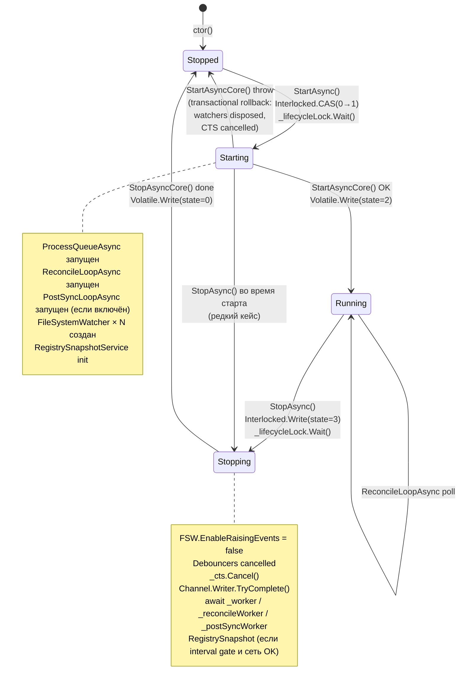

### Гарантии state machine

```
┌────────────┬──────────────────────────────────────────────────────────┐
│  Инвариант │  Реализация                                              │
├────────────┼──────────────────────────────────────────────────────────┤
│ Только     │  SemaphoreSlim(1,1) _lifecycleLock сериализует           │
│ один       │  Start/Stop — конкурентные вызовы ждут в очереди         │
│ переход    │                                                          │
├────────────┼──────────────────────────────────────────────────────────┤
│ Атомарная  │  Interlocked.CompareExchange(Stopped→Starting)           │
│ CAS-защита │  Concurrent Start/Stop видят актуальное состояние        │
├────────────┼──────────────────────────────────────────────────────────┤
│ Rollback   │  StartAsyncCore() обёрнута в try/catch                   │
│ при краше  │  Partial state fully unwound → Stopped                   │
│ в старте   │                                                          │
├────────────┼──────────────────────────────────────────────────────────┤
│ Idempotent │  Dispose() охраняется Interlocked.Exchange(_disposed)    │
│ Dispose    │  Concurrent SessionEnding + Stop path → no-op вторым     │
└────────────┴──────────────────────────────────────────────────────────┘
```

---

## 9. Deployment diagram — топология развёртывания

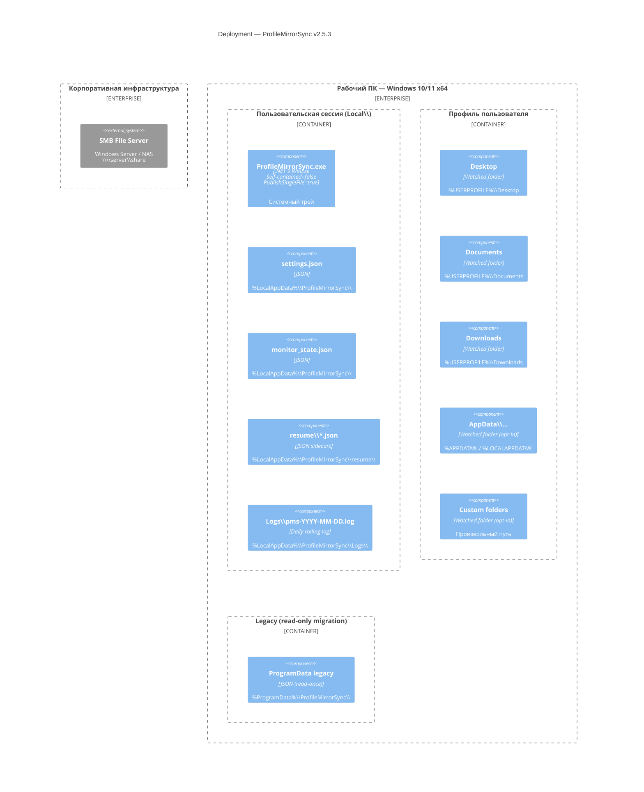

### Файловая топология назначения

```
\\server\share\
└── {MachineName}\                   ← NormalizeMachineRoot()
    └── {UserName}\                  ← Environment.UserName
        ├── Desktop\
        ├── Documents\
        ├── Downloads\
        ├── AppData\
        │   ├── Roaming\
        │   └── Local\
        ├── Custom\{C_Users_Den_Work}\  ← SanitizeName()
        ├── Logs\                       ← MirrorLogs=true
        │   └── pms-YYYY-MM-DD.log
        ├── Registry\                   ← MirrorRegistrySnapshots=true
        │   └── HKCU_Software.reg
        └── backup\                     ← PostSync archiver output
```

### Риски по правам и производительности в deployment

```
┌─────────────────────────┬───────────────────────────────────────────────────┐
│  Точка риска            │  Проявление / митигация                           │
├─────────────────────────┼───────────────────────────────────────────────────┤
│  SMB share latency      │  Directory.Exists() с 5-секундным таймаутом;      │
│  или недоступность      │  один Warn per outage (Interlocked flag)          │
├─────────────────────────┼───────────────────────────────────────────────────┤
│  vboxsf / NAS firmware  │  MoveFileEx(REPLACE_EXISTING) → отклонён;         │
│  не поддерживает rename │  автоматический fallback: Delete + Move           │
├─────────────────────────┼───────────────────────────────────────────────────┤
│  Права на запись в      │  %LocalAppData% всегда доступен пользователю;     │
│  директорию программы   │  exe может лежать в %ProgramFiles% (read-only)    │
├─────────────────────────┼───────────────────────────────────────────────────┤
│  SetFileTime на share   │  NotSupportedException ряда NAS;                  │
│  не поддерживается      │  перехвачен try/catch, non-fatal                  │
├─────────────────────────┼───────────────────────────────────────────────────┤
│  AV-сканер блокирует    │  Retry-with-backoff (3 атт., 1/2/4 с);            │
│  файл при копировании   │  Delete-failures для Rename → defer до reconcile  │
├─────────────────────────┼───────────────────────────────────────────────────┤
│  Большой HKCU для       │  reg.exe запускается с таймаутом 10 с при Stop;   │
│  reg-snapshot           │  убивается entireProcessTree при OCE              │
├─────────────────────────┼───────────────────────────────────────────────────┤
│  Много ПК в флоте       │  Jitter (±30–60% от интервала, seed=MachineName)  │
│ запускаются одновременно│  десинхронизирует нагрузку на сервер              │
└─────────────────────────┴───────────────────────────────────────────────────┘
```

---

## 10. Модель параллелизма

### Нити и задачи

```
┌──────────────────────────────────────────────────────────────────┐
│  UI Thread (WinForms message pump)                               │
│  ┌──────────────────────────────────────────────────────────┐    │
│  │ TrayApp · SettingsForm · StatsForm · LogViewerForm       │    │
│  │ PostToUi(BeginInvoke) ← все обратные вызовы              │    │
│  └──────────────────────────────────────────────────────────┘    │
├──────────────────────────────────────────────────────────────────┤
│  ThreadPool Tasks (Task.Run)                                     │
│  ┌─────────────────┐  ┌──────────────────┐  ┌─────────────────┐  │
│  │ProcessQueueAsync│  │ReconcileLoopAsync│  │PostSyncLoopAsync│  │
│  │ (single reader) │  │ (60s poll)       │  │(PostSync timer) │  │
│  └─────────────────┘  └──────────────────┘  └─────────────────┘  │
│  ┌───────────────────────────────────────────────────────────┐   │
│  │ FSW callbacks × N (OS-managed threads)                    │   │
│  │ → EnqueueChange() → Schedule() → Task.Delay debouncer     │   │
│  └───────────────────────────────────────────────────────────┘   │
│  ┌───────────────────────────────────────────────────────────┐   │
│  │ One-shot tasks:                                           │   │
│  │  MaybeCaptureRegistrySnapshotAsync()                      │   │
│  │  ResumeStateStore.CleanupOrphans()                        │   │
│  │  EmptyWorkingSet (2 min after reconcile)                  │   │
│  │  IsDestinationReachable probe (5s timeout)                │   │
│  └───────────────────────────────────────────────────────────┘   │
└──────────────────────────────────────────────────────────────────┘
```

### Разграничение доступа к разделяемым структурам

```
┌──────────────────────────────┬───────────────────────────────────────────────┐
│  Структура                   │  Механизм thread-safety                       │
├──────────────────────────────┼───────────────────────────────────────────────┤
│  _state (int)                │  Interlocked.CompareExchange / Volatile.Write │
│  _disposed (int)             │  Interlocked.Exchange                         │
│  _destinationWarningLogged   │  Interlocked.Exchange                         │
│  _statsFilesCopiedTotal      │  Interlocked.Increment / Add                  │
│  _statsLastReconcileTicks    │  Interlocked.Exchange / Read                  │
│  _highWaterMark              │  CAS retry loop (monotonic max)               │
│  _lastReportedWatermark      │  Interlocked.CompareExchange (one wins)       │
│  _lastDropLogTicks           │  Interlocked.CompareExchange                  │
│  _droppedSinceLastLog        │  Interlocked.Increment / Exchange             │
├──────────────────────────────┼───────────────────────────────────────────────┤
│  _dedupe (ConcDict)          │  ConcurrentDictionary (lock-free fast path)   │
│  _roots (ConcDict)           │  ConcurrentDictionary (.Values = snapshot)    │
│  _debouncers (ConcDict)      │  ConcurrentDictionary + per-key CTS           │
├──────────────────────────────┼───────────────────────────────────────────────┤
│  BoundedChannel              │  Designed for multi-writer / single-reader    │
│                              │  SingleReader=true, AllowSyncCont=false       │
├──────────────────────────────┼───────────────────────────────────────────────┤
│  PersistentStateStore        │  object _lock (все операции под локом)        │
│  ByteRateLimiter             │  object _lock (Refill + token subtract)       │
│  TurboModeController         │  object _lock + Volatile.Read на fast path    │
│  Logger                      │  object _lock (StreamWriter + history queue)  │
│  _hardExcludedWarned (HashSet│  _hardExcludedWarnLock (выделенный object)    │
├──────────────────────────────┼───────────────────────────────────────────────┤
│  _lifecycleLock              │  SemaphoreSlim(1,1) — async-safe              │
└──────────────────────────────┴───────────────────────────────────────────────┘
```

### Back-pressure в bounded channel

```
    Очередь заполнена?
         │
    ┌────▼────┐
    │ op.Kind │
    └────┬────┘
         ├── CreateOrChange ──► TryWrite (try fast-path)
         │                          │
         │                     полна → DROP + log(30s dedup)
         │                          │
         │                     _dedupe.TryRemove (повторная постановка
         │                     в очередь при следующем FSW-событии)
         │
         └── Delete / Rename ──► WriteAsync с linked CTS (5 s)
                                      │
                                 OK → удаление будет доставлено
                                      │
                                 timeout → DROP + _dedupe.Remove
                                 (reconcile подберёт следующим циклом)
```

---

## 11. Подсистема копирования файлов (ThrottledFileCopier)

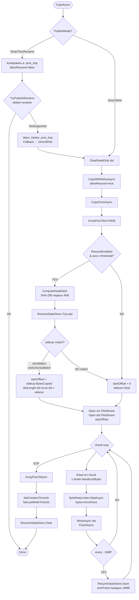

### Retry-with-backoff

```
CopyWithRetryAsync (максимум RetryCount = 5 попыток):

Попытка 1 ──► IOException/SocketException ──► delay 1s
Попытка 2 ──► IOException/SocketException ──► delay 2s
Попытка 3 ──► IOException/SocketException ──► delay 4s
Попытка 4 ──► OK ──► возврат
            (базовый delay = 200ms; удваивается, retryCount из AppSettings)

OperationCanceledException — НЕ перехватывается, propagates up
```

---

## 12. Алгоритм реконсиляции (три прохода)

```
ReconcileRootAsync(srcRoot, dstRoot, shouldIgnore, opts, onFileCopied, ct)
│
├── Проверка: Directory.Exists(srcRoot) → если нет — вернуть Empty
│
├── ══ PASS 1 ══ Copy new / changed ════════════════════════════════════
│   foreach file in SafeEnumerateFiles(srcRoot):
│     skip reparse points (junctions, symlinks)
│     skip UnauthorizedAccess directories
│     shouldIgnore(file)?  ──YES──► skip
│     IsUpToDate(file, dstFile)?  ──YES──► skip
│       IsUpToDate: File.Exists(dst)
│                  && dst.LastWriteTimeUtc == src.LastWriteTimeUtc
│                  && dst.Length == src.Length
│     CopyAsync(file, dstFile, ct)
│     filesCopied++, bytesCopied += srcLen
│     onFileCopied()   ← callback для turbo-mode + stats
│     if !turboActive && FileDelayMs > 0:
│       await Task.Delay(FileDelayMs)   ← только при реальном копировании
│     batchCount++; if batchCount % BatchSize == 0:
│       await Task.Delay(BatchPauseMs)
│
├── ══ PASS 2 ══ Delete orphans ═══════════════════════════════════════
│   EmptySourceGuard: если SafeEnumerateFiles(srcRoot) вернул 0
│     файлов и DeletionSafetyGuard=true → ABORT (защита от AV/placeholder)
│   foreach file in SafeEnumerateFiles(dstRoot):
│     srcEquiv = Path.Combine(srcRoot, relPath)
│     File.Exists(srcEquiv)?  ──YES──► skip (файл есть)
│     shouldIgnore(dstFile)?  ──YES──► skip
│     File.Delete(dstFile)  +  orphansDeleted++
│     [аналогично для пустых директорий]
│
└── ══ PASS 3 ══ Propagate directory timestamps (bottom-up) ══════════
    foreach dir in SafeEnumerateDirectories(srcRoot, bottom-up):
      srcMtime = dir.LastWriteTimeUtc
      dstMtime = dstDir.LastWriteTimeUtc (если существует)
      if srcMtime != dstMtime:
        Directory.SetLastWriteTimeUtc(dstDir, srcMtime)
        dirsTouched++
    (bottom-up: дочерние изменения не сбрасывают mtime родителя)
```

### ReconcileSummary — возвращаемые метрики

```
ReconcileSummary {
  FilesCopied:    int     // кредитуется _statsFilesCopiedTotal
  BytesCopied:    long    // кредитуется _statsBytesCopiedTotal
  OrphansDeleted: int     // кредитуется _statsFilesDeletedTotal
  FilesSkipped:   int     // кредитуется _statsErrorsTotal
  DirsTouched:    int     // информационно
}
```

---

## 13. Планировщик реконсиляции и адаптивный триггер

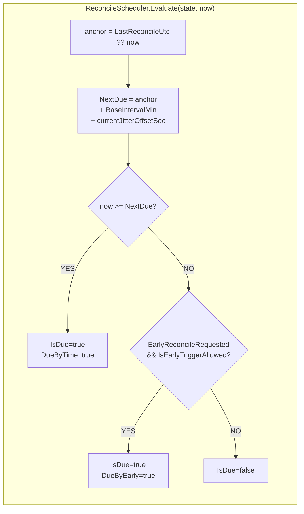

### Jitter-стратегия

```
BaseIntervalMinutes = max(5, ReconcileIntervalMinutes)   default = 1440 мин (24 ч)
JitterPercent       = clamp(ReconcileJitterPercent, 0, 100)  default = 30%

jitterRangeSec = BaseIntervalMinutes × 60 × JitterPercent / 100
               = 1440 × 60 × 0.30 = 25 920 сек (±12 960 сек = ±3.6 ч)

currentJitterOffsetSec ∈ [−12960, +12960]
seed RNG = Environment.MachineName.GetHashCode()  ← стабильный per-machine

В флоте из 10 ПК реконсиляции равномерно разбросаны по 24-часовому окну
вместо одновременного шторма на сервер.
```

### Адаптивный (early) триггер

```
В Enqueue() при TryWrite (fast path):

  pct = _dedupe.Count × 100 / _queueCapacity
  if pct >= EarlyReconcileQueueThresholdPct (default = 80):
    PersistentStateStore.Update(s => {
      if (!s.EarlyReconcileRequested) {
        s.EarlyReconcileRequested = true
        s.LastEarlyReconcileRequestUtc = now
        log.Info("Очередь N% ≥ threshold% — запрошена досрочная реконсиляция")
      }
    })

IsEarlyTriggerAllowed:
  (now - LastReconcileUtc) >= EarlyReconcileMinGapMinutes (default = 5)
  Предотвращает thrashing при непрерывном event-storm.
```

---

## 14. Расположение файлов и пути данных

### Файлы программы

```
 Компонент                     Путь
─────────────────────────────────────────────────────────────────────────
 Исполняемый файл              Любой, напр. %ProgramFiles%\PMS\
                               (read-only — не требует прав)
 Per-user data root            %LocalAppData%\ProfileMirrorSync\
 settings.json                 %LocalAppData%\ProfileMirrorSync\settings.json
 monitor_state.json            %LocalAppData%\ProfileMirrorSync\monitor_state.json
 resume sidecars               %LocalAppData%\ProfileMirrorSync\resume\<hash16>.json
 Логи                          %LocalAppData%\ProfileMirrorSync\Logs\pms-YYYY-MM-DD.log
 crash.log                     %LocalAppData%\ProfileMirrorSync\Logs\crash.log
 Legacy (migration source)     %ProgramData%\ProfileMirrorSync\settings.json  (read-once)
```

### Файлы назначения (SMB)

```
 Тип данных                    Путь на шаре
─────────────────────────────────────────────────────────────────────────
 Профиль пользователя          {DestinationRoot}\{MachineName}\{UserName}\
 Desktop                       …\Desktop\
 Documents                     …\Documents\
 Downloads                     …\Downloads\
 AppData\Roaming               …\AppData\Roaming\
 AppData\Local                 …\AppData\Local\
 AppData\LocalLow              …\AppData\LocalLow\
 Произвольная папка            …\Custom\{SanitizedPath}\
 Логи (MirrorLogs=true)        …\Logs\pms-YYYY-MM-DD.log
 Реестр (MirrorReg=true)       …\Registry\HKCU_Software.reg
 Архив (PostSync)              …\backup\  (аргументы конфигурируются)
```

### Атомарность записи

```
                  ┌────────────────────────────────────────────┐
 settings.json    │  1. Serialize → string json                │
 monitor_state    │  2. File.WriteAllText(path + ".tmp", json) │
 resume sidecar   │  3. File.Move(tmp, path, overwrite:true)   │
                  └────────────────────────────────────────────┘
 Гарантия: читатель всегда видит либо старый, либо новый файл целиком.
 Повреждённый settings.json → backup + reset to defaults (не молчащая потеря).
```

---

## 15. Надёжность и обработка ошибок

### Граф отказоустойчивости

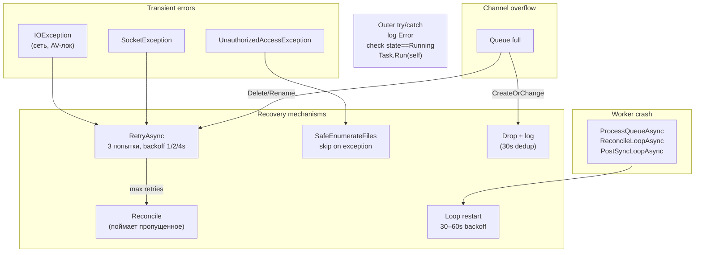

### Защита от пустого источника (DeletionSafetyGuard)

```
Сценарий риска:
  Профиль не смонтирован / AV поместил файлы в карантин /
  placeholder-файлы OneDrive = "источник пустой".
  Без защиты Pass 2 удалит ВСЁ с сервера.

Защита (DeletionSafetyGuardEnabled = true):
  if SafeEnumerateFiles(srcRoot).Count() == 0:
    log.Warn("Источник пуст — удаление на сервере заблокировано")
    return ReconcileSummary.Empty
```

### Защита от self-sync loop

```
_hardExcludes = {
  %ProgramData%\ProfileMirrorSync,
  %LocalAppData%\ProfileMirrorSync,   ← наши собственные данные
  AppContext.BaseDirectory,            ← директория exe
}

ShouldIgnore: любой путь, начинающийся с одного из hardExcludes → true
Если пользователь явно добавил директорию программы — один Warn в лог.
```

---

## 16. Фильтрация и исключение файлов

### Порядок проверок в `ShouldIgnore`

```
1. HardExcludes (HashSet)              — app dir, own data dir
2. AlwaysIgnoreFileNames (HashSet)     — desktop.ini, Thumbs.db, ehthumbs.db
3. AlwaysIgnoreExtensions (string[])  — .pms_tmp, .lnk, .tmp
4. AlwaysIgnoreSegments (string[])    — \$RECYCLE.BIN\, \System Volume Information\
5. UserExcludedRelativePaths          — из settings.json, через IsSegmentMatch()
```

### Алгоритм `IsSegmentMatch(path, pattern)`

Исправленный алгоритм обеспечивает точное граничное совпадение сегмента пути:

```
pattern `\bin\`      → match `proj\bin\Release\…`     YES
                     → match `proj\binary\…`          NO
pattern `AppData\Local\Temp` → match `C:\Users\x\AppData\Local\Temp\` YES
                              → match `C:\Users\x\AppData\LocalLow\`   NO
pattern `\.git\`     → match `proj\.git\HEAD`         YES
                     → match `proj\my.gitignore`       NO

Алгоритм:
  patHasLeadSep  = pat[0] == '\\'
  patHasTrailSep = pat[^1] == '\\'
  idx = 0; while (idx = path.IndexOf(pat, idx, OrdinalIgnoreCase)) >= 0:
    leftOk  = patHasLeadSep  || idx==0 || path[idx-1]=='\\'
    rightOk = patHasTrailSep || idx+len>=path.Length || path[idx+len]=='\\'
    if leftOk && rightOk: return true
    idx++
```

### Встроенные исключения по умолчанию

```
AppData\Local\Temp
AppData\Local\Microsoft\Windows\INetCache
AppData\Local\Microsoft\Windows\INetCookies
AppData\Local\Packages
AppData\Local\CrashDumps
AppData\Local\Google\Chrome\User Data\Default\Cache
AppData\Local\Microsoft\Edge\User Data\Default\Cache
AppData\Roaming\Spotify\Storage
AppData\Local\Discord\Cache
\obj\        ← build artifacts
\bin\
\.vs\
\node_modules\
\.git\
```

---

## 17. Периодические фоновые задачи

```mermaid
gantt
    title Временная шкала фоновых задач (типичный рабочий день)
    dateFormat HH:mm
    axisFormat %H:%M

    section ReconcileLoop
    Poll 60s intervals   : active, 00:00, 24:00

    section Reconcile (пример)
    Startup reconcile    : milestone, 08:00, 0h
    Scheduled +jitter    : milestone, 08:24, 0h
    Next + jitter        : milestone, 12:00, 0h

    section PostSync (1440min default)
    PostSync run         : milestone, 09:00, 0h

    section LogMirror (23h gate)
    Log mirror           : milestone, 08:25, 0h

    section RegistrySnapshot (30d gate)
    Registry snapshot    : milestone, 08:26, 0h
```

### Таблица фоновых задач

```
┌────────────────────────────┬──────────────────┬──────────────────────────────┐
│  Задача                    │  Интервал        │  Триггеры / примечания       │
├────────────────────────────┼──────────────────┼──────────────────────────────┤
│  ReconcileLoopAsync        │  poll каждые 60с │  Плановый + early trigger    │
│  (основной sweep)          │  интервал 24ч    │  queue pressure ≥ threshold  │
│                            │  ± jitter        │  мастер-ключ ReconcileEnabled│
├────────────────────────────┼──────────────────┼──────────────────────────────┤
│  PostSyncLoopAsync         │  PostSyncInterval│  Независимый таймер;         │
│  (внешний архиватор)       │  (default 1440m) │  1–10 min jitter при first   │
│                            │                  │  run; gate LastPostSyncUtc   │
├────────────────────────────┼──────────────────┼──────────────────────────────┤
│  LogMirrorService          │  ≤ 1 раз/23ч     │  После полного цикла         │
│  (копия лога на шару)      │                  │  реконсиляции всех корней    │
├────────────────────────────┼──────────────────┼──────────────────────────────┤
│  RegistrySnapshotService   │  RegistryBackup  │  При старте + по плановому   │
│  (reg.exe export HKCU)     │  IntervalMinutes │  reconcile; 10s timeout      │
│                            │  default 43200m  │  при Stop                    │
│                            │  (30 дней)       │                              │
├────────────────────────────┼──────────────────┼──────────────────────────────┤
│  EmptyWorkingSet           │  +2 мин после    │  psapi.EmptyWorkingSet()     │
│  (memory trim)             │ каждого reconcile│  best-effort, silent fail    │
├────────────────────────────┼──────────────────┼──────────────────────────────┤
│  ResumeStateStore.Cleanup  │  После каждого   │  Удаляет сайдкары старше     │
│  (orphan sidecar GC)       │  плановогорecon. │  ResumeSidecarMaxAgeDays     │
└────────────────────────────┴──────────────────┴──────────────────────────────┘
```

### Триггеры от системных событий (TrayApp)

```
SystemEvents.PowerModeChanged(Resume)  →  TriggerResumeReconcile()
                                           ждёт 30с → проверяет сеть → EnqueueAllReconcile()

SessionSwitch(SessionLogon)            →  TriggerResumeReconcile()  (если WakeOnSessionEvents)
SessionSwitch(SessionUnlock)           →  TriggerResumeReconcile()  (если WakeOnUnlock)

OnSessionEnding                        →  DoStopAsync() (минуя lifecycle lock)
                                           гарантирует чистое завершение при logoff/shutdown
```

---

## 18. Многопользовательская модель

```
┌──────────────────────────────────────────────────────────────────────┐
│  Один исполняемый файл (shared install, read-only %ProgramFiles%)    │
├──────────────────────────────────────────────────────────────────────┤
│                                                                      │
│  Сессия User_A                    Сессия User_B                      │
│  ┌──────────────────────────┐    ┌──────────────────────────┐        │
│  │ %LocalAppData%\PMS\      │    │ %LocalAppData%\PMS\      │        │
│  │  settings.json           │    │  settings.json           │        │
│  │  monitor_state.json      │    │  monitor_state.json      │        │
│  │  resume\*.json           │    │  resume\*.json           │        │
│  │  Logs\*.log              │    │  Logs\*.log              │        │
│  └───────────┬──────────────┘    └───────────┬──────────────┘        │
│              │                               │                       │
│              ▼                               ▼                       │
│  \\server\share\PC01\User_A\    \\server\share\PC01\User_B\          │
│                                                                      │
│  Single-instance mutex: Local\ProfileMirrorSync_SingleInstance       │
│  (Local\ = per-session, Global\ = all sessions)                      │
│  → каждая RDP/VDI-сессия может запустить свой экземпляр              │
└──────────────────────────────────────────────────────────────────────┘

Migration (одноразовая при первом запуске):
  if File.Exists(%ProgramData%\PMS\settings.json)
  && !File.Exists(%LocalAppData%\PMS\settings.json):
    File.Copy(%ProgramData%\PMS\settings.json, %LocalAppData%\PMS\settings.json)
```

---

## 19. Настройки и значения по умолчанию

### Основные параметры `AppSettings`

```
┌──────────────────────────────────┬──────────────────┬────────────────────────────┐
│  Параметр                        │  Default         │  Назначение                │
├──────────────────────────────────┼──────────────────┼────────────────────────────┤
│  DestinationRoot                 │  ""              │  SMB-шара (обязательно)    │
│  MaxBandwidthBitsPerSecond       │  1 000 000 bps   │  Базовый лимит (1 Мбит/с)  │
│  LogLevel                        │  Info            │  Debug / Info / Warning    │
│  SyncOnStartup                   │  true            │  Reconcile при старте      │
│  StartMinimizedToTray            │  true            │  Без окна настроек         │
├──────────────────────────────────┼──────────────────┼────────────────────────────┤
│  MirrorDesktop / Documents /     │  true / true /   │  Профильные папки          │
│  Downloads                       │  true            │  (остальные = false)       │
├──────────────────────────────────┼──────────────────┼────────────────────────────┤
│  FileDebounceMilliseconds        │  700 мс          │  Ожидание "тишины" после   │
│                                  │                  │  последнего FSW-события    │
│  ReconcileIntervalMinutes        │  1440 (24ч)      │  Плановый интервал         │
│  ReconcileJitterPercent          │  30%             │  ±15% от интервала         │
│  ReconcileEnabled                │  true            │  Мастер-ключ планового     │
├──────────────────────────────────┼──────────────────┼────────────────────────────┤
│  ReconcileFileDelayMs            │  20 мс           │  Пауза между файлами       │
│  ReconcileBatchSize              │  50 файлов       │  Размер батча              │
│  ReconcileBatchPauseMs           │  500 мс          │  Пауза после батча         │
├──────────────────────────────────┼──────────────────┼────────────────────────────┤
│  TurboFirstRunEnabled            │  true            │  Включить burst-режим      │
│  TurboThresholdFiles             │  1000            │  Порог очереди для turbo   │
│  TurboFirstRunBandwidthMbps      │  3 Мбит/с        │  Лимит в turbo-режиме      │
│  TurboOnReconcile                │  false           │  Turbo в плановом цикле    │
├──────────────────────────────────┼──────────────────┼────────────────────────────┤
│  QueueCapacity                   │  1000            │  Размер bounded channel    │
│  EarlyReconcileQueueThreshold    │  80%             │  Порог early trigger       │
│  EarlyReconcileMinGapMinutes     │  5 мин           │  Мин. между early triggers │
├──────────────────────────────────┼──────────────────┼────────────────────────────┤
│  RetryCount                      │  5               │  Попытки копирования       │
│  ResumeEnabled                   │  true            │  Byte-range resume         │
│  ResumeMinFileSizeBytes          │  10 MB           │  Порог для resume          │
│  ResumeSidecarMaxAgeDays         │  7 дней          │  TTL сайдкара              │
│  PublishMode                     │  DirectWrite     │  DirectWrite/TempThenRename│
├──────────────────────────────────┼──────────────────┼────────────────────────────┤
│  LowerIoPriority                 │  true            │  IO background priority    │
│  DeletionSafetyGuardEnabled      │  false           │  Защита от пустого src     │
│  LogRetentionDays                │  30 дней         │  Ротация логов             │
├──────────────────────────────────┼──────────────────┼────────────────────────────┤
│  PostSyncEnabled                 │  false           │  Внешний архиватор         │
│  PostSyncIntervalMinutes         │  1440 (24ч)      │  Независимый интервал      │
│  PostSyncExePath / Arguments     │  ""              │  Путь и аргументы exe      │
├──────────────────────────────────┼──────────────────┼────────────────────────────┤
│  MirrorRegistrySnapshots         │  false           │  reg.exe export HKCU       │
│  RegistryBackupIntervalMinutes   │  43200 (30 дней) │  Интервал reg-снимка       │
│  MirrorLogs                      │  false           │  Зеркалировать лог-файлы   │
│  SkipStartupReconcileIfWithin    │  5 мин           │  Пропуск startup reconcile │
│  Minutes                         │                  │  если недавно завершился   │
└──────────────────────────────────┴──────────────────┴────────────────────────────┘
```

### Token-bucket: ёмкость и эффективный диапазон

```
В режиме:           Burst cap (2s):     Минимальный chunk:   Минимальный rate:
─────────────────────────────────────────────────────────────────────────────
Baseline 1 Mbit/s   250 000 байт        4 096 байт           ~16 Kbit/s (UI min)
Turbo    3 Mbit/s   750 000 байт        4 096 байт           ~16 Kbit/s
Unlimited (0)       int.MaxValue        64 KB                 ∞
```

---
